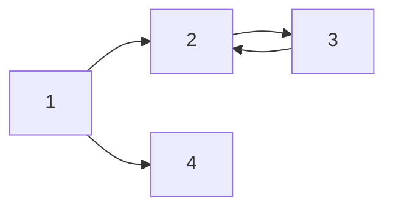

# Markdown 문법

## 1. 제목(heading)

제목은 `#` 으로 표현이 가능하다.(키보드의 맨 왼쪽 물결표 밑에 있는 것으로 감싸주기)

제목의 레벨은 `#`의 갯수로 나타내는데, 1~6단계까지 표현 가능하다.

### 제목3

#### 제목4

##### 제목5

###### 제목6

## 2. 목록

목록은 순서가 있는 목록과 순서가 없는 목록으로 구분된다.

1. 순서가 있는 목록

2. 순서가 있습니다.

   1. tab을 통해 단계를 표현할 수 있습니다.

   엔터

3. 엔터

* 순서가 없는 목록(까만색 점은 `*` 을 이용해서 나타낸다.)

  * tab을 통해 단계를 표현할 수 있습니다.

  엔터

* 엔터

## 3. 코드 블록

인라인 코드 블록과 전체 코드 블록이 있으며, 전체 코드 블록은 언어에 따른  syntax highlighting 기능을 대부분 지원한다.

`inline`

밑에는` ```python` 을 먼저 입력하고 나서 코드를 입력한 것이다.

```python
print('hello')
# 파이썬 주석
# ```python이라고 쓰면 이렇게 나옴
def foo(a):
    return a
```

```javascript
# 파이썬에서는 주석
// 자바스크립트 주석
```

## 4. 링크

[구글](https://google.com)

이건 ctrl + / 으로 직접 보자...

## 5. 인용문

> 인용문을 작성할 수 있습니다. (`>` 를 이용해서!)

## 6. 표

| 순번 | 이름   |
| ---- | ------ |
| 1    | 홍길동 |
| 2    | 박윤수 |

## 7. 이미지


위의 이미지는 절대 경로(C드라이버로) 작성되어 있기 때문에, 외부에 공개(github)하면 이미지가 깨져보인다.

따라서, 다음과 같이 typora 설정을 하자!

* 파일 > 환경 설정에서 `이미지` 탭 클릭하고 아래의 내용 모두 체크
  * 로컬 이미지에 위 규칙 적용
  * 온라인 이미지에 위 규칙을 적용
  * 가능하다면 상대적 위치 사용
* copy image to custom folder를 누른 후
  * `./폴더명` 으로 저장


이후에 다시 이 markdown문서에 그림을 넣으면 아래처럼 `markdown`파일이 저장된 폴더 안에서`images`폴더가 새로 생기고 여기에 저장했던 그림이 저장될 것임


## 8. 기타 문법

수직선

---


**굵게(볼드체)**

*이탤릭체*

~~취소선~~

------

## 9. 다이어그램

밑에는 ````mermaid`라고 입력하고나서 쓴 것이다.

자세한 것인 `ctrl+/`을 눌러서 확인하자.




